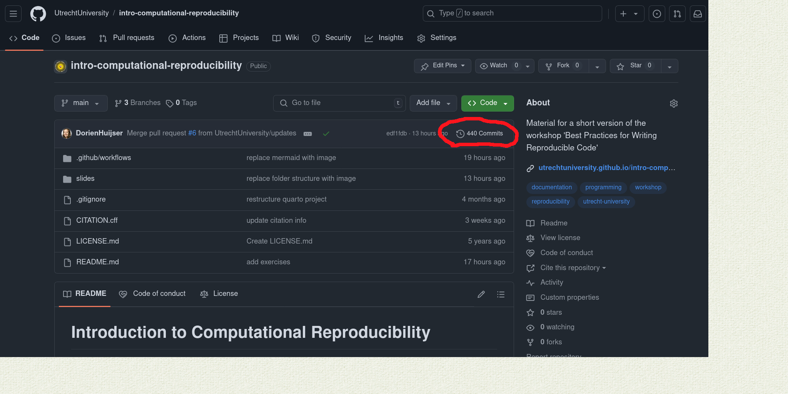
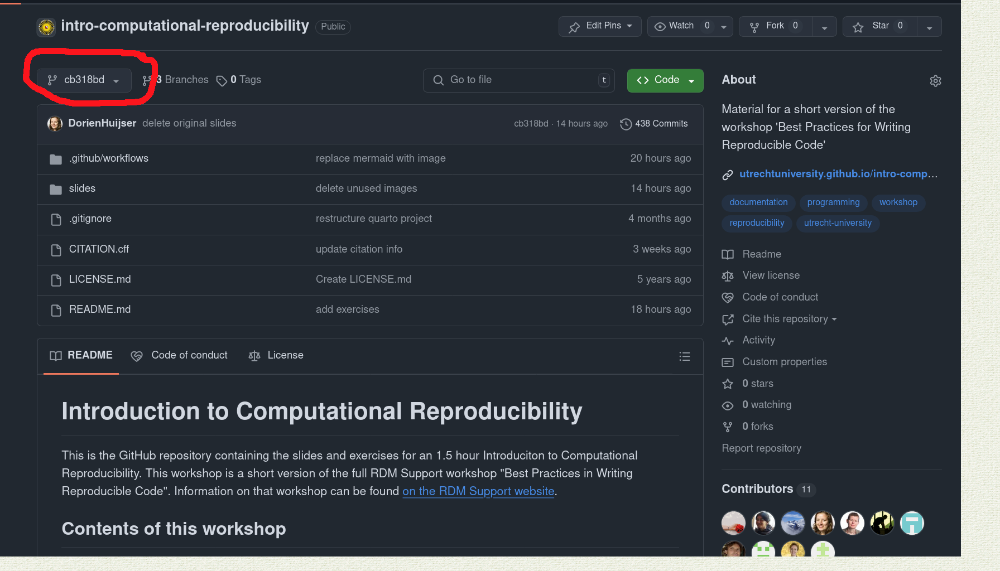

# Introduction to Computational Reproducibility

This is the GitHub repository containing the slides and exercises for an 1.5 hour Introduciton to Computational Reproducibility. 
This workshop is a short version of the full RDM Support workshop "Best Practices in Writing Reproducible Code". 
Information on that workshop can be found [on the RDM Support website](https://www.uu.nl/en/research/research-data-management/training-workshops/best-practices-for-writing-reproducible-code).

## Contents of this workshop 

1. Introduction (5 min)
2. Project structure ( 5 min)
3. Documentation (5 min)
4. Code quality (5 min)
5. Git and GitHub (10 min)  
   EXERCISES  
6. Closing (2 mins)

## Exercises

### For people new to Git and GitHub
We learn to do some basic things with GitHub via the GitHub website.

#### Step 1: Create a GitHub account [https://github.com/signup](https://github.com/signup)

#### Step 2: Go to this template repository and browse it: [github.com/UtrechtUniversity/simple-python-template](https://github.com/UtrechtUniversity/simple-python-template)

#### Step 3: Clone the repository:

- Go back to the [main page](https://github.com/UtrechtUniversity/simple-python-template) of the repository and click the green 'Use this template' button. 
- A drop down menu will appear. Select 'Create a new repository'
- Choose a repository name, e.g. `my-first-github-repository`. If interested, read more on [repository naming conventions](https://climbtheladder.com/10-github-repository-naming-best-practices/)
- Choose 'public', which means everyone can see this repository
- Click 'Create repository'

#### Step 4: Make a change to the README file
After creating the repository you automatically land on the main page of the repository. Note the web address of this page: `github.com/<your profile name>/<your repository name>`. The page displays the contents (folders and files) of the repository and underneath the page displays the contents of the `README.md` file. We will now make a change to the README file.

- Click the pencil icon at the top right of the README file to edit the file.
- Write and/or delete something in the editor
- In the top of the editor, click Preview to check your changes. Click edit if you want to continue editing.
- The filename extension of the README is `.md` which stands for markdown. Markdown is a markup language for editing text documents. Check [this markdown guide](https://www.markdownguide.org/basic-syntax/) for more information about the syntax.

#### Step 5: Commit the changes

When you commit changes, you create a new snapshot of your project for the projects' history.
- When you have finished editing the file, click the green button 'Commit changes...' in the top right of the window.
- Write an informative commit message about the change you made for the project log
- Make sure the option 'Commit directly to the main branch' is selected and click 'Commit changes'

#### Step 6: Inspect the git history (or project log)

You have now created a new snapshot of your project. We are now going to watch a previous version of the project.

- After you clicked 'Commit changes' you are redirected to the main page of your GitHub repository.
- To go to your git history, click 'Commits' which you can find at the top right of the contents of your repository.

- In your case you will see two 'Commits' (aka snapshots). To browse an earlier version of your repository, click `<>` at the right side of the commit with message "Initial commit".
- Verify that the change that you made is not there.
- To go back to the up-to-date state of your project, click the drop down arrow at the top left of the repository contents and under 'Branches' select 'main'.

If there is time left, you may continue with one the exercises on skills.github.com (see the section below).

### For people that have used Git and GitHub before:

[skills.github.com](skills.github.com) is a nice collection of exercises to practice the GitHub workflow. Depending on your skill level, choose one of the following lessons:

- [Introduction to github](https://github.com/skills/introduction-to-github)
- [Communicate via Markdown](https://github.com/skills/communicate-using-markdown)
- [Create a website with GitHub Pages](https://github.com/skills/github-pages)
- [Collaborate using Pull requests](https://github.com/skills/review-pull-requests)
- [Solving merge conflicts](https://github.com/skills/resolve-merge-conflicts)
- [Getting started with GitHub actions](https://github.com/skills/hello-github-actions)
- [Test with GitHub actions](https://github.com/skills/test-with-actions)

We think the lessons above are the most relevant for research. Feel free to choose other lessons, however the instructors might not be familiar with the topic in case you need help.

## License

The slides are licensed under a [Creative Commons Attribution 4.0 International License](http://creativecommons.org/licenses/by/4.0/). [View the license here](https://github.com/UtrechtUniversity/workshop-computational-reproducibility/blob/main/LICENSE.md).

## Acknowledgements

These slides were adapted from the workshop [Best Practices in Writing Reproducible Code](https://utrechtuniversity.github.io/workshop-computational-reproducibility/) by the following people:

-   [Dorien Huijser](https://github.com/dorienhuijser)
-   [Jelle Treep](https://github.com/jelletreep)
-   [Raoul Schram](https://github.com/qubixes)

To contribute, please open an Issue or Pull Request, or contact [Research Data Management (RDM) support](https://www.uu.nl/en/research/research-data-management).
